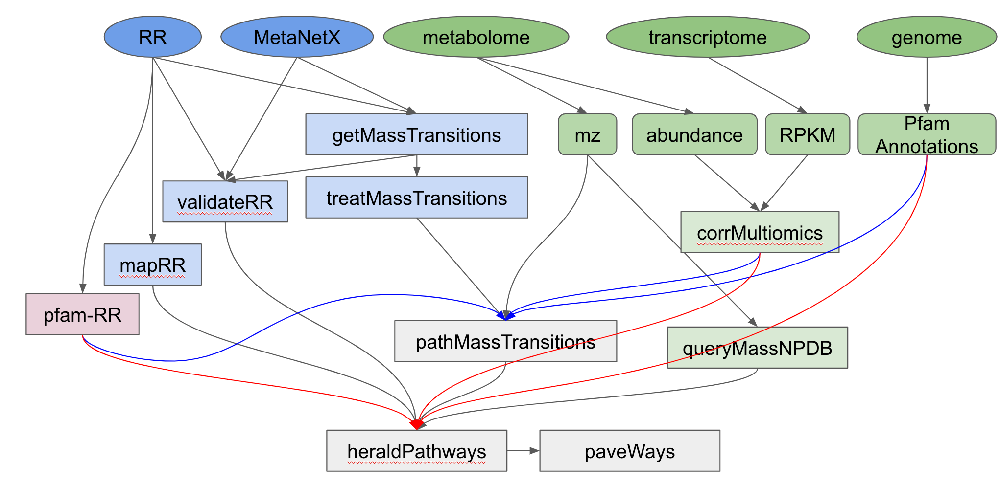

Usage
=====

Databases availability
***********************

* The MetaNetX database release "chem_prop.tsv", which can be downloaded from their website: https://www.metanetx.org/mnxdoc/mnxref.html

* The RetroRules database version "rr_01" in SQLite (named mvc.db), which can be downloaded from their website: https://retrorules.org/dl

* The Retrorules-Pfam annotations, which have been curated and can be found in the github repository

* LOTUS database is available in the form of an sqlite database within the GitHub repository

MEANtools workflow
===================

Arrows:
~~~~~~~~
* Arrows in this workflow show where the input of which script comes from.

* Grey arrows show the simplest workflow: only using metabolome information.

* Red and blue arrows show the additional steps when using transcriptome data as well. Introducing transcriptomic data acts as a filter: reactions without associated correlated transcripts are filtered out. Because of this, when using the blue arrows (recommended), the red arrows are not necessary.

Squares:
~~~~~~~~
* Blue-colored squares are the DATABASE PREPARATION phase. These scripts parse the RetroRules database to extract the data pertinent to MEANtools. These steps only need to be performed once: upon downloading the RetroRules database.

* Green-colored squares are the OMICS DATA PREPARATION phase.

* Red-colored square is a list annotating the data from the RetroRules database and its PFAM predictions. This can be downloaded from #TODO.

* Grey-colored squares are the PREDICTION phase.

Input Description:
==================

Metabolomics data
~~~~~~~~~~~~~~~~~~

.. _installation:

Installation
------------

To use MEANtools, first install it using pip:

.. code-block:: console

   (.venv) $ pip install meantools

Workflow
---------

